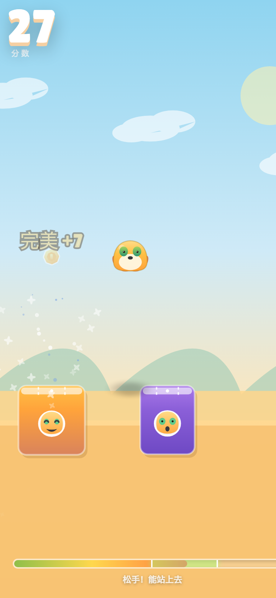

# 奶娃跳一跳 🐣

<p align="center"></p>

一个**打开网页就能玩**的手机小游戏：长按屏幕蓄力，松手起跳，落点越靠平台中心得分越高。

> 单指操作 · 一局 30～60 秒 · 竖屏 9:16 · 纯前端零依赖

在线试玩：**https://zh-yuchen.github.io/naiwa-jump/**

---

## 玩法

| 操作 | 结果 |
| --- | --- |
| 长按屏幕 | 蓄力，力度条增长，奶娃被压扁 |
| 松手 | 按当前力度抛物线跳出 |
| 落在平台边缘 | 普通得分 **+1**，连击清零 |
| 落在平台中心的虚线区 | **完美 +2**，连击 +1 |
| 连续完美 | 每多一连击再加分（最高 +7/跳），弹出梗图文字 |
| 跳到平台外 | 奶娃掉落，「破防了，再來一局？」 |

- **随机平台**：宽度和间距随分数递增而收窄/拉大（`难度 = min(1, 分数/45)`）。
- **力度条绿区**：显示「能站上去」的力度区间；越到后面绿区越窄。
- **完美区**：每个平台顶面有一条白色虚线，虚线内即完美判定（宽度 = 平台宽 × 20%，最小 6px）。
- **本机存档**：最高分、最高连击、Top 10 都存 `localStorage`。
- **在线排行榜**：打完自动上榜，见下方「排行榜」。
- **晒成绩**：一键生成成绩卡图片，可直接长按保存发群里。

## 排行榜

用的是 **TinyWebDB**（`https://tinywebdb.appinventor.space/api`）——给 App Inventor 用的极简
key-value 云存储，POST 表单调用，跨域头是 `Access-Control-Allow-Origin: *`，
所以**纯静态页也能直接读写，不用自建后端**。

| 项 | 值 |
| --- | --- |
| action | `update`（写）、`search`（按 tag 前缀读） |
| tag | `nwj_<36进制时间戳>_<随机4位>` |
| value | `{"n":"昵称","s":分数,"t":时间戳}` |
| 榜单 | **最近 20 次提交**的滚动时间窗 |

**为什么是时间窗而不是历史最高榜**：分数只在你还在窗口里的那段时间有效，后来的人会不断把你挤
出去，所以卡榜首、长期占位没意义，也不会有一条永远刷不掉的纪录。

几个刻意的处理：

- 只写自己那一条，**从不 delete、从不改别人的数据**；旧成绩是被挤出时间窗的，不是被清掉的。
- 昵称存 `localStorage`（`naiwa.name`），去控制字符、按码点限长 12 字，空串一律当「默认用户」。
- 自动提交时校验：**0 分不上榜**、两次提交至少隔 3 秒、分数 > 99999999 不收。
- 榜单全部用 `textContent` 渲染，不拼 HTML，杜绝 XSS。
- 网络不通只是排行榜打不开 —— 游戏照常玩，榜单退回显示本机记录。
- 接口偶发 502 会自动重试一次。

换账号：改 `leaderboard.js` 顶部的 `USER` / `SECRET`（同样用异或编码存放，不明文），
换 `PREFIX` 相当于另开一张榜。

## 四种表情

平台贴纸和奶娃本体都会随情境切换表情：

| 表情 | 触发时机 |
| --- | --- |
| 😄 开心 | 完美落地 |
| 😑 无语 | 普通落地 / 落回原平台 |
| 😲 震惊 | 蓄力中 / 落在平台边角 |
| 💔 破防 | 跳空坠落 |

连续完美会弹出「这就是奶娃！」「抽象！」「哇哦——！」等梗图文字。

## 技术

```
index.html      页面骨架 + 覆盖层（开始/结束/排行榜/成绩卡）
style.css       竖屏 9:16 样式，safe-area 适配
game.js         全部游戏逻辑（约 950 行，无框架）
leaderboard.js  在线排行榜（TinyWebDB 读写 + 弹窗渲染）
preview.png     预览图
assets/
  bgm.mp3       背景音乐
  sfx/*.mp3     Kenney CC0 音效（jump/land/coin/fall/break）
  img/*.png     Kenney CC0 贴图（影子 / 粒子 / 金币）
  fonts/        Lilita One（SIL OFL 1.1）—— 分数与按钮字体
  meme-*.jpg    奶娃梗图（覆盖层背景）
```

- **渲染**：单个 `<canvas>` + `requestAnimationFrame`。虚拟坐标系宽 400 单位，按屏幕宽度等比缩放，物理量不随屏幕尺寸漂移。`devicePixelRatio` 上限 2.5。
- **物理**：

  ```
  vx  = 40 + 力度 × 300            （单位/秒）
  vy₀ = -(180 + 力度 × 420)
  g   = 1500
  水平射程 = vx × 2|vy₀| / g       → 9.6 ～ 272 单位
  ```

  松手瞬间即定死 `vx / vy`，之后只受重力，标准抛物线；落地判定用「上一帧在平台面之上、这一帧在平台面之下」的穿越检测，避免高速穿透。
- **音频**：两套并行 —— Kenney CC0 音效走 `<audio>` 播放池（复用 + 每次随机音高 0.9–1.1，做法参考 Godot 版 `scripts/audio.gd`）；「哇哦」「抽象」等奶娃专属音效由 Web Audio 实时合成（两个共振峰带通滤波扫频），所以即使用户网络抖动也不会没声音。
- **手机适配**：`touch-action:none` + 阻止 `gesturestart`/`dblclick`/`touchmove`，关掉双击缩放与下拉刷新；横屏时显示「请竖屏」提示。

## 本地运行

直接双击 `index.html` 即可（全部是相对路径，`file://` 下也能跑）。

iOS 上如果 `file://` 没声音，起个静态服务器：

```bash
python -m http.server 8080     # 然后访问 http://localhost:8080
```

## 测试

```bash
node _smoke/harness.js
```

用最小 DOM/Canvas 桩件真跑主循环，覆盖 37 项断言：连续 30 次完美落地、连击与加分曲线、
难度递增后「平台更窄 / 间距更大但仍在最大射程内」、跳空结束、排行榜落库、完美落地弹金币、
贴图缺失时自动退回矢量绘制、成绩卡可生成、横竖屏遮罩切换、昵称清洗、防刷分限流、
榜单解析与时间窗、断网降级、120 帧渲染无异常。

## 授权

- 代码：MIT
- 音效 / Lilita One 字体：来自 [Kenney Starter Kit 3D Platformer](https://github.com/nicktacke/Starter-Kit-3D-Platformer)（MIT），其中素材为 **CC0**，字体为 **SIL OFL 1.1**。许可证全文见 `LICENSE-kenney-mit.md` 与 `assets/fonts/OFL-lilita-one.txt`。
- 奶娃角色与梗图：版权归原作者所有，仅作个人学习/娱乐用途；正式发布前建议替换为自制素材。
